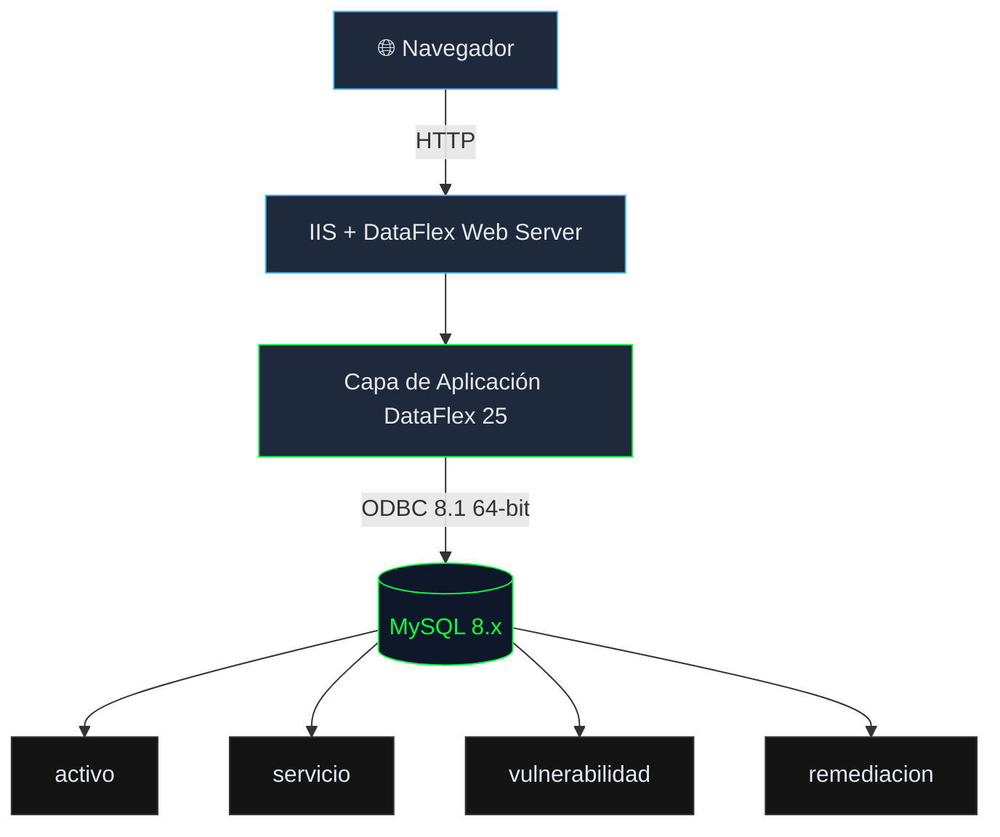

# 🛡️ VulnTrack

[](https://www.dataaccess.com/)
[](https://www.mysql.com/)
[]()
[]()
[]()

> 🎓 Proyecto desarrollado como tarea de prácticas del ciclo **DAW** en **Data Control Tecnologías de la Información** — 2026.

*Antes de atacar, necesitamos saber qué hay ahí fuera. Esto es eso.*

---


## ¿Qué es esto?

Aplicación web de gestión construida con DataFlex 25 y MySQL, con temática de ciberseguridad. Permite llevar un registro manual de activos de red, los servicios que corren en cada uno, las vulnerabilidades conocidas asociadas y el estado de remediación de cada una.

No escanea redes, no consulta APIs externas ni detecta nada automáticamente — eso está en el roadmap. Por ahora es un inventario estructurado con un esquema de datos real, pensado para entender cómo funciona la gestión de vulnerabilidades antes de automatizarla.
```
Registrar activo → Definir servicios → Asociar CVEs → Gestionar remediación
```

---

## 🚀 Funcionalidades

- Inventario completo de activos de red — host, IP, sistema operativo, tipo de dispositivo
- Registro de servicios por activo con nombre, versión y puerto
- Gestión de vulnerabilidades con código CVE, descripción y severidad CVSS
- Seguimiento de remediación: `pendiente → en progreso → resuelta`
- CRUD completo con vistas Select y Zoom por cada entidad
- Dashboard centralizado con acceso directo a cada módulo
- Tema visual táctico oscuro con terminal green

---

## 🏗️ Arquitectura



---

## 🗄️ Esquema de base de datos

Cuatro tablas en cadena limpia:

```
activo (id, nombre, ip, sistema_operativo, tipo)
  └── servicio (id, activo_id FK, nombre, version, puerto)
        └── vulnerabilidad (id, servicio_id FK, cve_codigo, descripcion, severidad)
              └── remediacion (id, vulnerabilidad_id FK, estado, notas, fecha)
```

| Tabla | Descripción |
|-------|-------------|
| `activo` | Activo de red: host, IP, SO, tipo |
| `servicio` | Servicio corriendo: nombre, versión, puerto |
| `vulnerabilidad` | CVE conocido: código, descripción, severidad CVSS |
| `remediacion` | Estado de remediación: pendiente, en progreso, resuelta |

Los datos de prueba incluyen **20 CVEs reales** — Log4Shell, ProxyLogon, PwnKit, Dirty Pipe, Baron Samedit, Spring4Shell, entre otros.

---

## 🛠️ Stack técnico

| Capa | Tecnología |
|------|-----------|
| Aplicación | DataFlex 25 — Web Mobile Project |
| Base de datos | MySQL 8.x |
| Conector | MySQL ODBC 8.1 (64 bits) |
| Plataforma | Windows / IIS |

---

## 📸 Demo

> *Capturas próximamente*

---

## 🗺️ Roadmap

- [ ] Integración con API NVD (NIST) para ingesta automática de CVEs:
  - Configurar: Inicializar el objeto HTTP, apuntarlo al host del NIST y activar HTTPS.

  - Ejecutar la petición pasando la ruta con el CVE.

  - Capturar el JSON de la respuesta.

  - Parsear el JSON en un cJsonObject.

  - Extracción de Datos.

  - Inyección en BBDD.
- [ ] Control de acceso por roles
- [ ] Exportación de informes PDF/CSV para auditorías
- [ ] Importación desde salidas de nmap para poblar activos automáticamente
- [ ] Alertas para CVEs con severidad crítica (CVSS ≥ 9.0)

---

## ⚙️ Instalación

```sql
-- 1. Crear la base de datos
mysql -u root -p < vulntrack.sql

-- 2. Crear DSN de sistema ODBC apuntando a vulntrack
-- 3. Abrir VulnTrackApp.sws en DataFlex Studio
-- 4. Compilar y lanzar
```

## ⚙️ Configuración local

Antes de compilar, generar una clave de cifrado de sesiones en `AppSrc/WebApp.src`:

Genera una en PowerShell:
```powershell
-join ((65..90) + (97..122) + (48..57) | Get-Random -Count 40 | ForEach-Object {[char]$_})
```

---

## ⚠️ Contexto académico

Proyecto desarrollado como tarea de prácticas del ciclo formativo **Desarrollo de Aplicaciones Web (DAW)** en **Data Control Tecnologías de la Información**, 2026.

El dominio elegido (ciberseguridad) y el diseño del esquema son propios. La herramienta utilizada (DataFlex 25) viene impuesta por la empresa de prácticas.

---

## 📄 Licencia

MIT
